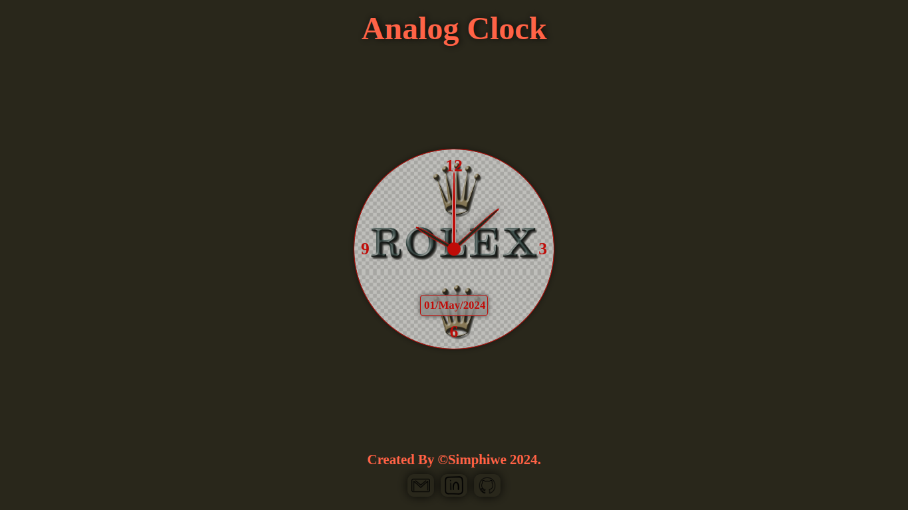
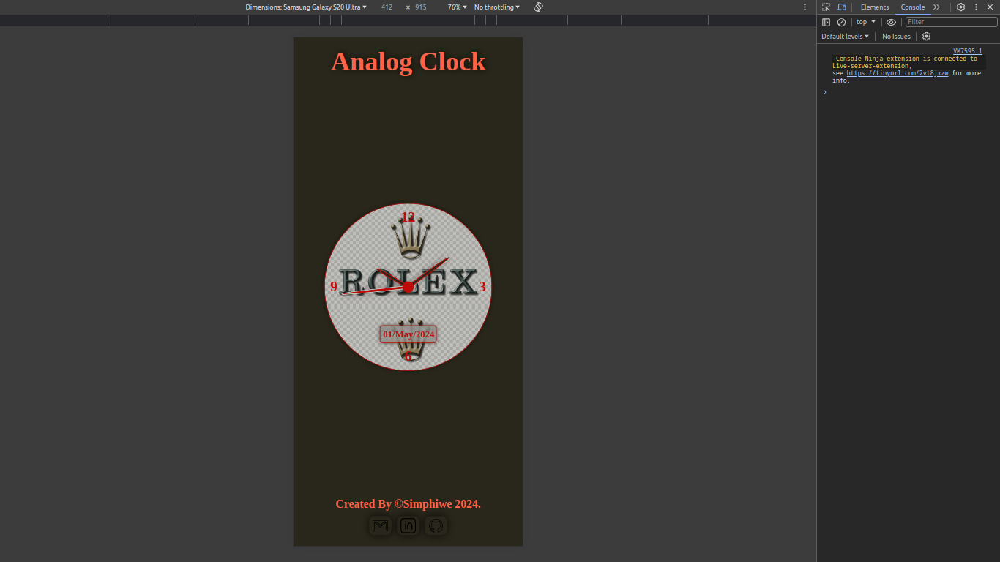

# Analog Clock

Check it _**LIVE**_ 👉
**<https://deebest.github.io/analog-clock/>**

An analog clock web application, dynamically changing the degrees of the clock hands based on the real time.

## Features

- Dynamic time changing based on the real time.
- Current date display.

## Uses

- The app can be used for checking time and date

## Tech Stack Used

- GIT
- HTML
- CSS
- JavaScript

## Get In Touch 👇

Email : **<simphiwedladla8@gmail.com>**

Linked: **<https://www.linkedin.com/in/dladla-simphiwe-89061a20a/>**

Github: **<https://github.com/DeeBest>**

Portfolio: **<https://deebest.github.io/personal-webpage/>**
